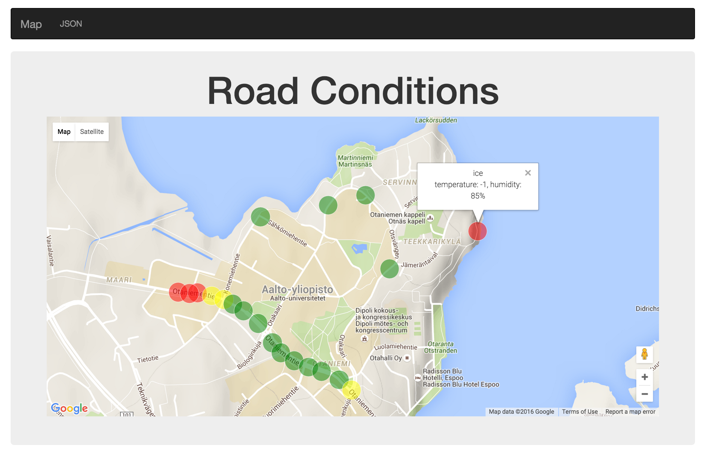

# Road Conditions App

MEAN Stack Application for showing road conditions collected by embedded sensors on cars. Road conditions are stored to MongoDB using REST Api. This repository is solely 

Based on [starter application](https://github.com/scotch-io/starter-node-angular) made by scotch.io.

## Installation
1. Install npm modules: `npm install`
2. Install bower dependencies `bower install`
3. Start up the server: `node server.js`
4. View in browser at http://localhost:8080

## Post datapoints
Using for example postman, datapoints can be posted to http://localhost:8080/api/nerds using x-www-form-urlencoded format.
Example values:

| Key                 | Value                         |   
|---------------------|:-----------------------------:|
|geometry[coordinates]| 24.840558, 60.188861          |
|properties[name]     | temperature: -1, humidity: 85%|
|properties[condition]| ice                           |

